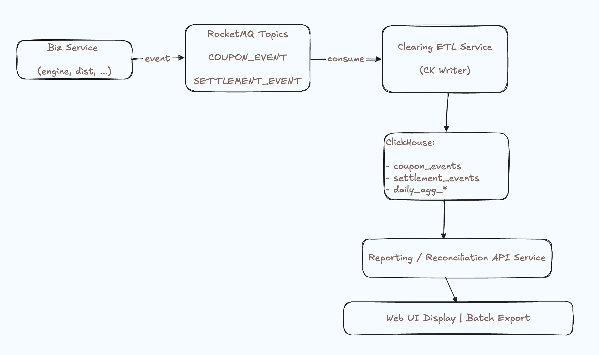
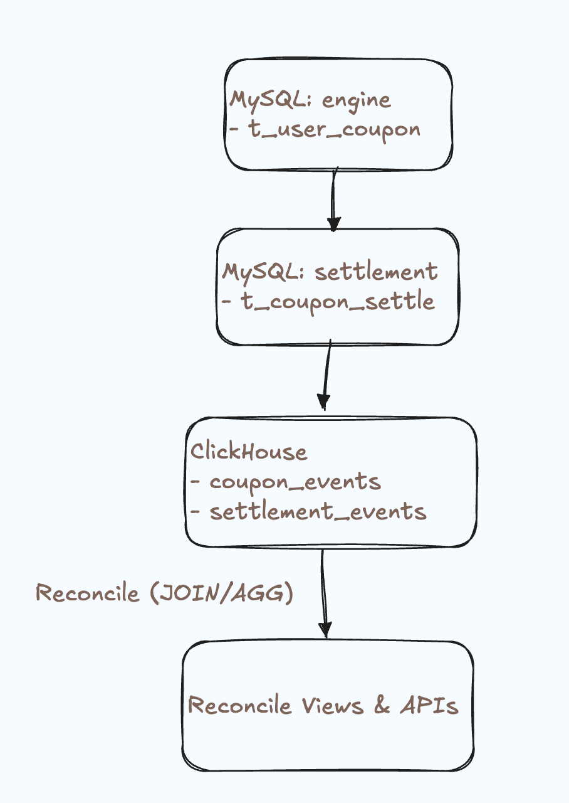

## 06 Event-Driven Reconciliation & ClickHouse Reporting

> This document builds on the CQRS + Saga architecture to design an **event -> ClickHouse -> reporting API** pipeline
> for clearing, reconciliation, and analytics. It includes core flow diagrams, ClickHouse computation modes, and
> RocketMQ integration choices.

--- 

### 1. Goals and Use Cases

**Goals**

- Normalize key business actions (redeem, batch distribution, consume, refund, settlement) into events and write them to
  ClickHouse.
- Support **clearing, reconciliation, reporting, and near-real-time analytics** on top of those events.
- Integrate naturally with existing RocketMQ topics with minimal impact on core business flows.

**Typical use cases**

- Template view: per template and date range - **issued / redeemed / consumed / refund / expired** counts and amounts.
- User view: all coupon-related movements for a given user over a billing peirod.
- Settlement view: reconcile "engineer ledger" (user coupon tables), "settlement ledger" (settlement tables), and "
  recon-ledger" (ClickHouse aggregates)

---

### 2. High-Level Core FLows

#### 2.1 Main flow: business events -> ClickHouse



#### 2.2 Reconciliation: engine vs settlement vs recon



---

### 3. Event Model (RocketMQ Integration)

#### 3.1 Standardized event schema

Define unified event DTOs(e.g., in `onecoupon-api`)

```text
CouponEvent
- eventId (UUID)
- eventType (REDEEMED / DISTRIBUTED / CONSUMED / REFUNDED / EXPIRED)
- eventTime (business time)
- bizDate (yyy-MM-dd, for CK partition)
- userId 
- couponId
- couponTemplateId
- orderId (optional)
- amount (face value / discount / consume amount)
- source (CENTER / PLATFORM / SHOP / BATCH_DISTRIBUTION)
- extra (JSON for extensions)

SettlementEvent:
- eventId 
- eventType (SETTLEMENT_CREATED / CONFIRMED / RESERVED)
- settlementId
- orderId
- userId
- couponId
- amountBefore 
- discountAmount
- amountAfter
- bizDate
- extra
```

#### 3.2 Event producers (hooked into existing flows)

After core business operations succeeded (within or just after the local transaction), publish normalized events to
dedicated topics like `COUPON_EVENT_TOPIC` and `SETTLEMENT_EVENT_TOPIC`:

- `UserCouponRedeemConsumer` -> `CouponEvent {REDEEMED}`
- `CouponExecuteDistributionConsumer` -> batched `CouponEvent {DISTRIBUTED}`
- Future payment/refund consumers -> `CouponEvent {CONSUMED / REFUNDED}`

> This does **not** change existing logic; it just emits additional "ledger events" for downstream clearing and
> reporting.

---

### 4. ClickHouse Table Design & Computation Modes

#### 4.1 Fact tables (event detail)

- `coupon_events_all` (fact table)

```text
CREATE TABLE coupon_events_all (
    event_id String, 
    event_type LowCardinality(String),
    event_time DateTime, 
    biz_date Date, 
    user_id UInt64, 
    coupon_id UInt64,
    coupon_template_id UInt64, 
    order_id UInt64, 
    amount Decimal(18, 2),
    source LowCardinality(String),
    extra String
)
ENGINE = MergeTree
PARTITION BY biz_date
ORDER BY (biz_date, event_type, coupon_template_id, user_id); 
```

`settlement_events_all` is symmetric for settlement events.

#### 4.2 Aggregation tables and materialized views

ClickHouse supports multiple computation patterns:

**Direct fact queries (MergeTree scan)**

- Simple, flexible; may be slow for large time ranges, but fine for recent (e.g., last 1 day).

**Pre-aggregated tables + materialized views (recommended)**

- Example: daily aggregates per template/shop/eventType:

```text
CREATE TABLE coupon_daily_agg (
    biz_date Date, 
    coupon_template_id UInt64,
    shop_id UInt64, 
    event_type LowCardinality(String),
    cnt UInt64, 
    amount_sum Decimal(18,2)
)
ENGINE=SummingMergeTree
PARTITION BY biz_date
ORDER BY (biz_date, coupon_template_id, shop_id, event_type); 
```

- Materialized view (pseudo code):

```text
CREATE MATERIALIZED VIEW mv_coupon_events_to_agg
TO coupon_daily_agg AS
SELECT
    biz_date,
    coupon_template_id,
    toUInt64(JSONExtract(extra, 'shopId', 'UInt64', 'UInt64')) AS shop_id,
    event_type,
    count() AS cnt, 
    sum(amount) as amount_sum
FROM coupon_events_all
GROUP BY biz_date, coupon_template_id, shop_id, event_type;    
```

**Batch / offline jobs (complex joins, T+1 reconciliation)**
For heavy multi-day, multi-dimension reconciliation, schedule jobs run complex joins/aggregations and write to
`*_reconcile` tables.

> For our use case (online reports + reconciliation), the main path should be **fact table + materialized views**, with
> optional batch jobs for heavy offline checks.

---

### 5. RocketMQ -> ClickHouse: Subscription & Ingestion Options

#### 5.1 Possible ingestion patterns

**Application service (Clearing ETL) consuming MQ and writing CK** - **recommended**

- A dedicated Spring Boot service consumes RocketMQ topics and writes to ClickHouse via JDBC/HTTP.
- Pros: tight integration with existing stack, fine-grained control over batching, retry, and idempotency.

**RocketMQ Connect / CDC pipeline to ClickHouse**

- External connectors sync topics into ClickHouse
- Pros: low-code, cons: more operational complexity, stricter schema governance, trickier debugging.

**Intermediate landing (OSS/HDFS) -> batch import to CK**

- Suitable for offline/T+1 analytics, **not** for near-real-time reporting.

#### 5.2 Recommended choice and rationale

We recommended **pattern 1: a dedicated Clearing ETL Services**:

- Matches our existing Spring Boot + RocketMQ setup.
- Let us implement idempotent writes keyed by `event_id`.
- Allows one consumer to populate multiple CK tables (facts + derived tables) based on event type.

---

### 6. Reporting & Reconciliation APIs (Overview)

Build a Reporting / Reconciliation service (new `reporting` module for under `settlement`) that queries ClickHouse:

- `GET /api/report/coupon-daily`
    - Params: `bizDate`, `shopId`, `templateId`, `eventType` ...
    - Data source: `coupon_daily_agg`

- `GET /api/report/coupon-user-detail`
    - Params: `userId`, `from`, `to`, `eventType`...
    - Data source: `coupon_event_all` (paginated fact queries)

- `GET /api/reconcile/coupon-vs-settlement`
    - Params: `bizDate`, `shopId`, `templateid`, ...
    - Logic: join/compare:
        - engine MySQL aggregate (t_user_coupon*)
        - settlement MySQL aggregate (t_coupon_settlement*)
        - ClickHouse aggregates (coupon_events_all / coupon_daily_agg)
    - Return a summary of differences + drill-down links if needed.

---

### 7. Summary

- **Flow diagrams**: two ASCII diagrams describe the event ingestion pipeline and the three-ledger reconciliation view.
- **ClickHouse computation modes**: direct fact queries, MV-backed summaries, and offline batch jobs, with a
  recommendation to adopt **fact + MV aggregates** as the primary pattern.
- **RocketMQ integration**: three ingestion patterns are described, and the chosen one is a dedicated Clearing ETL
  service consuming RocketMQ and writing to ClickHouse for optimal control and simplicity.


