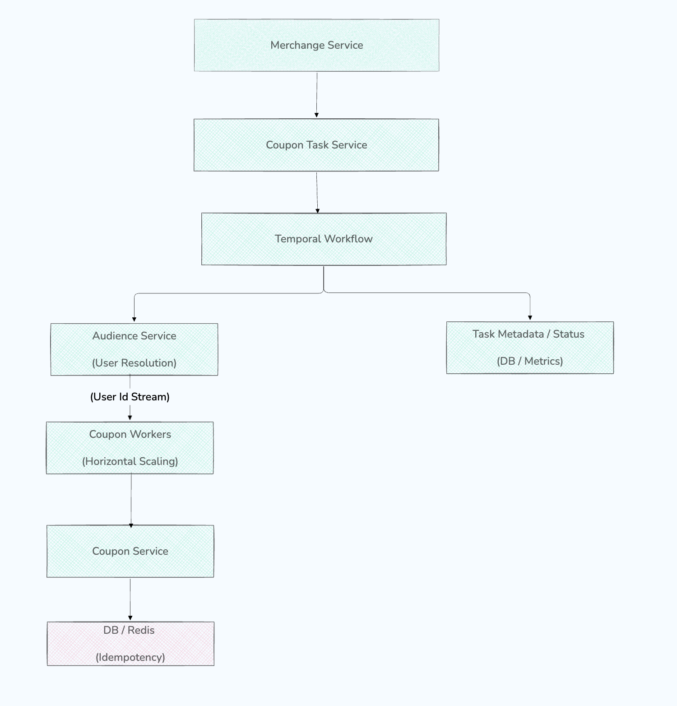

# Coupon Distribution System Redesign (Cloud Native Oriented)

## Background

The current coupon distribution is designed around file-based batch processing and polling-based scheduling.
While functional, it introduces significant limitations in scalability, observability, and cloud-native compatibility.

This document outlines the problems in the existing system and proposes a cloud-native, event-driven redesign using
Temporal as the orchestration engine.

## Current Architecture (Simplified)

```text
Merchant 
-->
Upload Excel -> Object Storage 
--> 
Submit Task (Excel URL + TemplateId)
-->
Event 
--> 
Distributed Service
-->
Download Excel -> Parse Row by Row 
--> 
Send Coupon 

Scheduler: 
DB (task table) --> XXL-Job polling -> Trigger execution
```

## Key Problems

### File-Based Data Input (Excel)

- Tight coupling between data and execution logic
- No streaming capability (must fully download and parse)
- Poor observability (no progress tracking per user)
- Coarse retry granularity (batch-level retry)
- Violates service boundary (merchant supplies user IDs)

### Incorrect User Targeting Model

- Merchants should not directly manage raw user IDs
- No abstraction for audience selection
- Lack of integration with user segmentation / tagging systems

### Polling-Based Scheduling (XXL-Job)

- Inefficient DB polling
- High latency in task triggering
- Poor scalability under large task volumes
- Not aligned with cloud-native / event-driven patterns

### Batch Execution Model

- Sequential or semi-parallel processing
- Limited horizontal scalability
- Weak backpressure handling
- Hard to guarantee idempotency

## Design Goals

- Event-driven architecture
- Decoupled task definition and execution
- Streaming-based user distribution
- Fine-grained observability and retry
- Strong idempotency guarantees
- Cloud-native orchestration

## Proposed Architecture

### High-Level Architecture



## Core Components

### Coupon Task Service

Responsible for:

- Accepting merchant requests
- Defining coupon distribution tasks
- Starting Temporal workflows

Example request:
POST /coupon-task

```json 
{
  "templateId": "xxx",
  "audience": {
    "type": "TAG",
    "condition": {
      "tag": "new_user"
    }
  },
  "scheduleTime": "2026-04-10T10:00:00Z"
}
```

### Temporal Workflow (Orchestration Layer)

Responsibility:

- Scheduling execution (delayed start)
- Coordinating audience resolution
- Managing retries and failure recovery
- Tracking progress and status

Workflow steps:

```text
- Wait until scheduleTime
- Trigger Audience Service 
- Stream userIds in batches 
- Dispatch distribution tasks 
- Track success/failure metrics 
```

### Audience Service

Responsible for resolving user sets:
Support modes:

- Tag-based (e.g., active users)
- Rule-based (SQL-like filters)
- External upload (optional, converted to internal dataset)

Output:

- Stream or paginated userId batches

### Coupon Workers

- Stateless workers
- Consume user batches (via Temporal activities)
- Execute coupon issuance
- Horizontally scalable

### Idempotency Layer

Key:

```text
(userId, templateId)
```

Implementation:

- Redis SETNX or
- DB unique

Ensures:

- Safe retries
- No duplicate coupon issuance

## Execution Model (Streaming Fan-out)

```text
Audience Service -> userId batches -> Temporal Activities -> Workers -> Coupon Service 
```

Advantages:

- Parallel processing
- Fine-grained retry
- Backpressure control
- Observable progress

## Temporal vs Kafka Feasibility Analysis

### Kafka-Based Approach (Alternative)

Architecture:

```text
Task -> Kafka -> Scheduler -> Kafka -> Workers 
```

#### Pros

- High throughput
- Native streaming model
- Strong decoupling

#### Cons:

- Complex orchestration logic
- Hard to manage retries across multiple stages
- No built-in workflow state
- Requires additional state tracking (DB)

### Temporal-Based Approach (Chosen)

#### Pros:

- Durable workflow state
- Built-in retry semantics
- Precise scheduling (timers)
- Clear execution visibility
- Simplifies orchestration logic

#### Cons:

- Slightly higher latency vs pure Kafka streaming
- Requires Temporal cluster operation
- Not ideal for ultra-high-throughput raw streaming

### Why Temporal Fits This Use Case

Coupon distribution is:

- Task-oriented (not pure streaming)
- Requires orchestration (schedule + retries + tracking)
- Needs strong observability

Temporal provides:

- Deterministic workflow execution
- Built-in state persistence
- Fine-grained retry control

Conclusion:
Temporal is better suited than Kafka for orchestration-heavy workflows like coupon distribution, while Kafka is more
appropriate for pure data streaming pipelines.

## Migration

### Phase 1

- Keep Excel input
- Convert parsed data into internal user stream

### Phase 2

- Introduce Audience Service
- Support tag-based targeting

### Phase 3

- Replace XXL-Job with Temporal

### Phase 4

- Remove Excel dependency

# Summary

The re-designed system transition from:

- File-based -> Service-based input
- Batch processing -> Streaming fan-out
- Polling scheduling -> Event-driven orchestration

By adopting Temporal , the system gains:

- Better reliability
- Improved scalability
- Strong observability
- Cloud-native alignment

This architecture is more suitable for large-scale coupon distribution scenarios with complex targeting and scheduling
requirements.
